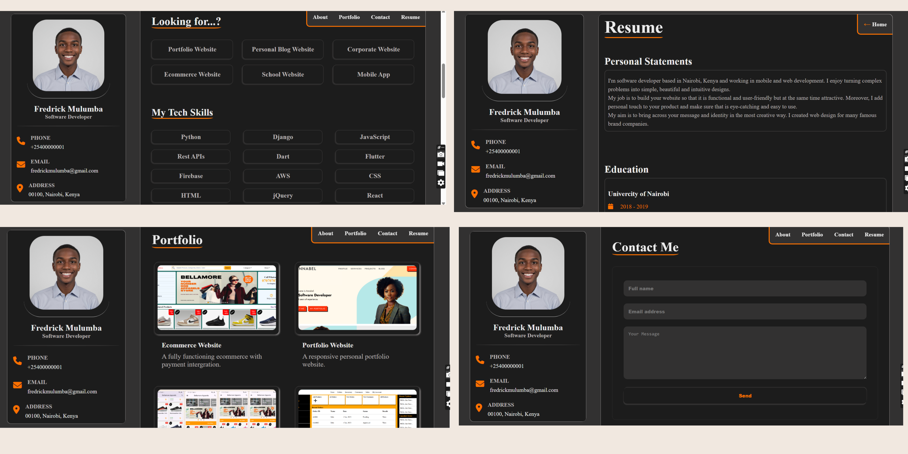

# Fredrick-Portfolio-Website

A responsive portfolio website for Fredrick, built using HTML, CSS, and JavaScript.

## Demo

### Desktop View

### Mobile View

## Contact

If you want to contact me you can reach me at [Linkedin](https://www.linkedin.com/in/paulmagadi).

## License

MIT
